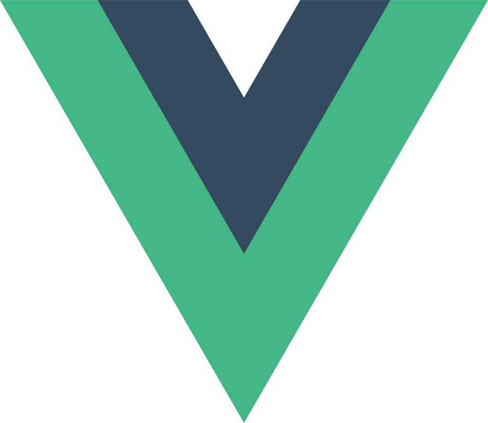

<h1 align="center">Welcome to mini-anything 👋</h1>

  
  
  

> 🚀 mini-anything 是一个集合了前端领域的各种迷你版本的库，方便前端学习者学习，探索前端源码。里面的库是原库的超级迷你版本，只包含原库的主流程，不包含边界 case，所以建议仅学习使用，请勿用于生产环境

### 🏠 [Homepage](https://github.com/Sunny-117/mini-anything)

# documentation

## JS 工具库

✅ mini-axios

## 框架

> 由于 Vue, React 较为复杂，mini-vue 和 mini-react 在其他仓库(WIP)

✅ mini-vue3

https://github.com/sunny-117/tiny-vue

✅ mini-vue2

https://github.com/sunny-117/mini-vue2

✅ mini-react

https://github.com/sunny-117/tiny-react

✅ mini-react-hooks

✅ mini-vue-reactivity

## Vue 生态

✅ mini-vue-router3

✅ mini-vuex4

✅ mini-mini-vuex3 100 行写一个 vuex

✅ mini-pinia

✅ mini-mini-pinia 40 行写一个 pinia

✅ mini-pinia-ts 最接近官方的 pinia 实现

## React 生态

✅ mini-react-router4

✅ mini-react-router5

✅ mini-redux

✅ connected-react-router

✅ mini-react-redux

### Redux 中间件

✅ mini-redux-promise

✅ mini-redux-thunk

✅ mini-redux-saga

## 工具链

✅ mini-create-react-app-template

## 上层框架

✅ mini-dva

✅ mini-plugin-dva-loading

## 工程化

✅ mini-webpack

✅ mini-vite

详见：https://github.com/Sunny-117/tiny-vite

✅ mini-rollup

详见：https://github.com/Sunny-117/cherry

✅ mini-jest

迷你单元测试框架

## NodeJS 生态

✅ mini-nodemon

✅ mini-express

✅ mini-koa

## 插件

📝 vite 插件

✅ mini-webpack-loader-plugins

📝 rollup plugin

## 状态管理

✅ mini-mobx

<h2>💼 repo</h2>
<table>
  <thead align="center">
    <tr>
      <th>logo</th>
      <th>迷你项目名称</th>
      <th>简述</th>
      <th>技术</th>
    </tr>
  </thead>
  <tbody align="center">
    <tr>
      <th>
        
      </th>
      <th>
        <a href="" target="_blank">mini-vue3</a>
      </th>
      <th>⚡️ vue3 核心包: reactivity, compile, runtime</th>
      <th>
        
        
      </th>
    </tr>
    <tr>
      <th>
        
      </th>
      <th>
        <a href="" target="_blank">mini-react</a>
      </th>
      <th>🦋 React 核心包: core, scheduler, reconciler</th>
      <th>
        
        
        
      </th>
    </tr>
    <tr>
      <th>
        
      </th>
      <th>
        <a href="#" target="_blank">Vue Router3</a>
      </th>
      <th>🐝 Vue 路由 version: 3</th>
      <th>
        
        
      </th>
    </tr>
    <tr>
      <th>
        <a href="#" target="_blank">
         
      </th>
      <th>
        <a href="#" target="_blank">Vuex</a>
      </th>
      <th>✨ Vuex 迷你实现</th>
      <th>
        
        
      </th>
    </tr>
    <tr>
      <th>
        <a href="#" target="_blank">
        
      </th>
      <th>
        <a href="https://github.com/sunny-117unxlsx" target="_blank">mini-pinia</a>
      </th>
      <th>🌸 Pinia 您将喜欢使用的 Vue 存储库</th>
      <th>
        
        
      </th>
    </tr>
    <tr>
      <th>
        <a href="#" target="_blank">
        
      </th>
      <th>
        <a href="#" target="_blank">ahooks</a>
      </th>
      <th>🦄 一套高质量可靠的 React Hooks 库</th>
      <th>
        
        
        
        
      </th>
    </tr>
    <tr>
      <th>
        
      </th>
      <th>
        <a href="#" target="_blank">react-router</a>
      </th>
      <th>🏎 React 中的路由</th>
      <th>
        
        
      </th>
    </tr>
    <tr>
      <th>
        
      </th>
      <th>
        <a href="#" target="_blank">Redux</a>
      </th>
      <th>🎸 JavaScript 状态容器，提供可预测化的状态管理</th>
      <th>
        
        
        
      </th>
    </tr>
    <tr>
      <th>
        
      </th>
      <th>
        <a href="#" target="_blank">redux-thunk</a>
      </th>
      <th>🌍 Thunk middleware for Redux^_^</th>
      <th>
        
        
      </th>
    </tr>
    
  </tbody>
</table>

      未完待续

🖥 Environment Suppor

- Modern browsers
- NodeJS

## Author

👤 **sunny-117**

- Website: https://sunny-117.github.io/blog/
- Github: [@sunny-117](https://github.com/sunny-117)

## 🤝 Contributing

Contributions, issues and feature requests are welcome! Feel free to check [issues page](https://github.com/Sunny-117/mini-anything/issues). You can also take a look at the [contributing guide](https://github.com/Sunny-117/mini-anything/blob/main/CONTRIBUTING.md).

## Show your support

Give a ⭐️ if this project helped you!

## 📝 License

Copyright © 2023 [sunny-117](https://github.com/sunny-117). 
This project is [MIT](https://opensource.org/licenses/MIT) licensed.

---

_This README was generated with ❤️ by [readme-md-generator](https://github.com/kefranabg/readme-md-generator)_
