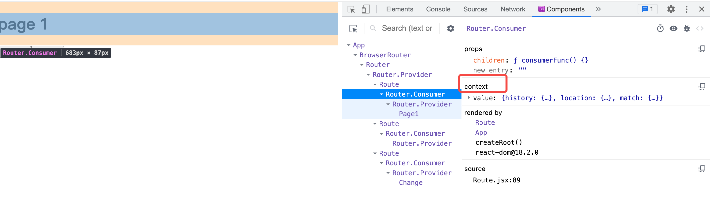

# Route

1. 提供一个上下文：history，location都是一样的，只是match匹配不一样，所以需要用一个新的上下文记录匹配结果，让后续组件知道是怎么匹配的
2. 根据匹配的结果，决定渲染什么东西（根据children，render，component）
 
 优先级：
 
 * - 配置了children，render和component无效
 * - 配置了render，会调用render，忽略component
 * - 前两个都没有配置，component生效





# APP测试

```jsx

// import React from 'react'
// import { Router } from './react-router'
// import { BrowserRouter } from 'react-router-dom'
// import { createBrowserHistory } from './react-router/history'
// const history = createBrowserHistory()

// import { BrowserRouter } from './react-router-dom'

// export default function App() {
//   return (
//     <div>
//       {/* <Router history={history}>
//       </Router> */}
//       <BrowserRouter
//         basename="/news"
//       >11</BrowserRouter>
//     </div>
//   )
// }
/****************************************************************Route以前的测试代码**************************************************************** */


import React from 'react'

import { BrowserRouter, Route } from './react-router-dom'
export default function App() {
  function Page1() {
    return <h1>page 1</h1>
  }
  function Page2() {
    return <h1>page 2</h1>
  }
  function Change({ history }) {
    // 如果不放在Route里面是拿不到history的
    return <div>
      <button onClick={() => {
        history.push('/page1')
      }}>去page1</button>
      <button onClick={() => {
        history.push('/page2')
      }}>去page2</button>
    </div>
  }
  return (
    <div>
      <BrowserRouter>
        <Route path="/page1" component={Page1}></Route>
        <Route path="/page2" component={Page2}></Route>
        {/* 如果不加path，就认为路径规则就是/ */}
        <Route component={Change}></Route>
      </BrowserRouter>
    </div>
  )
}


```