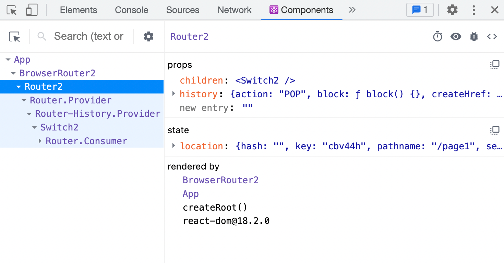

# Switch

Switch：匹配Route子元素，渲染第一个匹配到的Route


```jsx
import React from 'react'
import { BrowserRouter, Route, Switch } from "./react-router-dom"

function Page1() {
    return <h1>Page1</h1>
}

function Page2() {
    return <h1>Page2</h1>
}

export default function App() {
    return (
        <BrowserRouter>
            <Switch>
                <Route path="/page1" component={Page1} />
                <Route path="/page1" component={Page1} />
                <Route path="/page2" component={Page2} />
            </Switch>
        </BrowserRouter>
    )
}

```


# 组件结构

只会显示自己匹配到的，其他的Route也不会显示




# 实现Switch

循环Switch组件的children，依次匹配每一个Route组件，当匹配到时，直接渲染，停止循环
