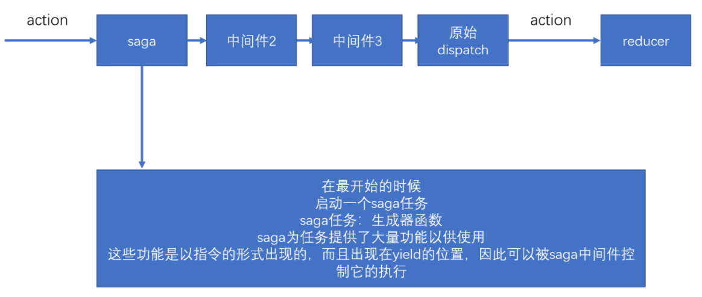

# redux-saga

中文文档地址：https://redux-saga-in-chinese.js.org/

● 纯净，不像前两种方式那样污染action
● 强大
● 灵活
● saga不会像前两种方式那样阻止action的移交

在saga任务中，如果yield了一个普通数据，saga不作任何处理，仅仅将数据传递给yield表达式（把得到的数据放到next的参数中），因此，在saga中，yield一个普通数据没什么意义。

**saga需要你在yield后面放上一些合适的saga指令**（saga effects），如果放的是指令，saga中间件会根据不同的指令进行特殊处理，以控制整个任务的流程。

每个指令本质上就是一个函数，该函数调用后，会返回一个指令对象，saga会接收到该指令对象，进行各种处理

**一旦saga任务完成（生成器函数运行完成），则saga中间件一定结束**

● take指令：【阻塞】监听某个action，如果action发生了，则会进行下一步处理，take指令仅监听一次。yield返回的是完整的action对象
● all指令：【阻塞】该函数传入一个数组，数组中放入生成器，saga会等待**所有的生成器全部完成后**才会进一步处理
● takeEvery指令：【不阻塞】不断的监听某个action，当某个action到达之后，运行一个函数。takeEvery永远不会结束当前的生成器。所以可以监听多个action
● delay指令：【阻塞】阻塞指定的毫秒数
● put指令：用于重新触发action，相当于dispatch一个action
● call指令：【可能阻塞，是promise就阻塞】用于副作用（通常是异步）函数调用
● apply指令：【可能阻塞】用于副作用（通常是异步）函数调用
● select指令：用于得到当前仓库中的数据
● cps指令：【可能阻塞】用于调用那些传统的回调方式的异步函数
● fork：用于开启一个新的任务，该任务不会阻塞，该函数需要传递一个生成器函数，fork返回了一个对象，类型为Task
● cancel：用于取消一个或多个任务，实际上，取消的实现原理，是利用generator.return。cancel可以不传递参数，如果不传递参数，则取消当前任务线。
● takeLastest：功能和takeEvery一致，只不过，会自动取消掉之前开启的任务
● cancelled：判断当前任务线是否被取消掉了
● race：【阻塞】竞赛，可以传递多个指令，当其中任何一个指令结束后，会直接结束，与Promise.race类似。返回的结果，是最先完成的指令结果。并且，该函数会自动取消其他的任务

# 手写saga

saga中间件的原理：

1. 首先启动一个任务
2. 当action触发时，直接将action分发到下一个中间件

源码分析：

1. runSaga：一个函数，用于启动一个任务，一个任务的本质是一个generator function，runSaga在内部得到该函数的generator，并控制生成器的每一次迭代。