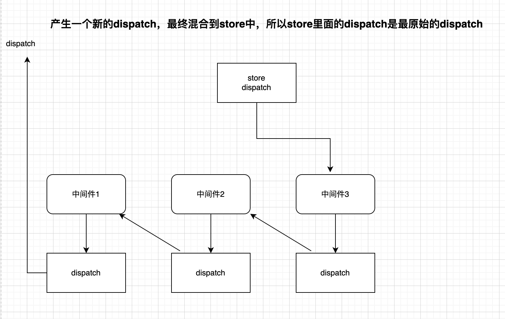

# applyMiddleware

middleware的本质，是一个调用后可以得到dispatch创建函数的函数

compose：函数组合，将一个数组中的函数进行组合，形成一个新的函数，该函数调用时，实际上是反向调用之前组合的函数


# 基础结构

```js
export default function (...middlewares) {
  return function (createStore) {
    //给我创建仓库的函数
    //下面的函数用于创建仓库
    return function (reducer, defaultState) {
      //创建仓库
    };
  };
}

```


dispatch踩坑

