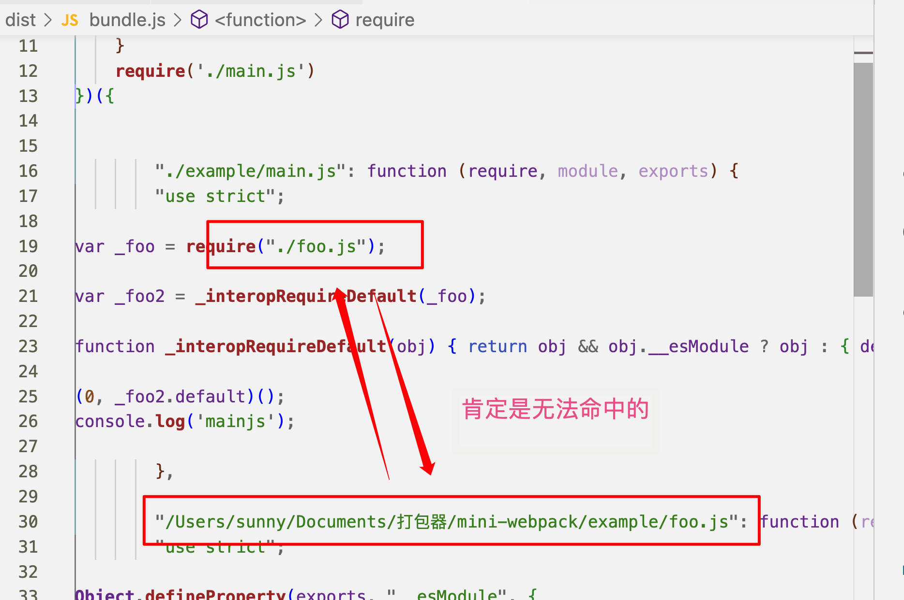
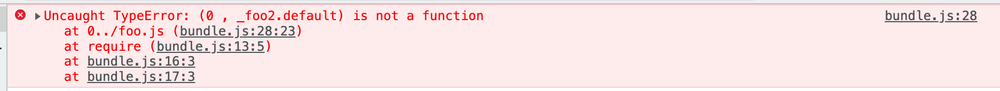
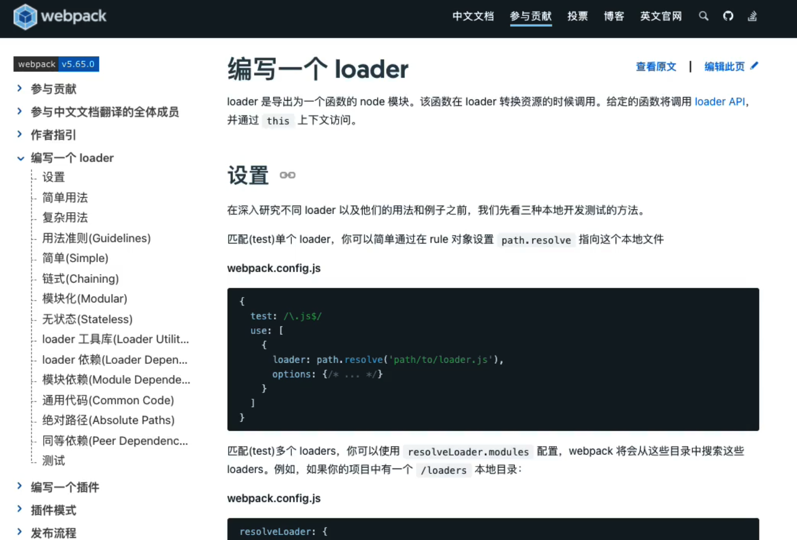

# mini-webpack

打包器的核心：多个小的模块合并成一个大模块，让浏览器可以允许我们打包好的大的模块

## 思路

图结构

1. 内容
2. 依赖关系


## 流程

创建两个文件：foo.js 和 main.js, 打包后将会和入到一个文件 bundle.js 中


```js
// foo.js 
export function foo() {
    console.log('foo')
}
```

```js
// main.js
import foo from './foo.js'
foo()
console.log('mainjs')
```

```js
// bundle.js

function mainjs() {
    //TODO: esm-翻译->cjs
    import foo from './foo.js'
    foo()
    console.log('mainjs')
}

function foojs() {
    export function foo() {
        console.log('foo')
    }
}

```

### 1. 获取文件内容

```js
const source = fs.readFileSync(filePath, {
    encoding: 'utf-8'
})
```


### 2. 获取依赖关系

方法1: 正则

方法2: ast

通过ast可以获取到当前文件里的代码里面的所有的信息，它会把字符串转换成一个树，树里面都有对应的节点，节点里面都有代表每一块内容

通过babel处理 `@babel/parser`

```ts
const ast = parser.parse(source, {
    sourceType: "module"
})
console.log(ast) // 就是这棵树的根节点
```

获取树的节点：babel有工具`@babel/traverse`

```js
traverse.default(ast, {
    /**
     * 访问到ImportDeclaration节点的时候会调用此函数
     */
    ImportDeclaration({ node }) {
        // console.log(node.source.value)
        deps.push(node.source.value) // 存取依赖关系
    }
})

```

# 文件合并

```js
(function (modules) {
    function require(filePath) {
        const fn = modules[filePath]
        const module = {
            exports: {

            }
        }
        fn(require, module, module.exports)
        return module.exports
    }
    require('./main.js')
})({
    './foo.js': [function (require, module, exports) {
        function foo() {
            console.log('foo')
        }
        module.exports = {
            foo
        }
    }, {}],
    './main.js': [function (require, module, exports) {
        const { foo } = require('./foo.js')
        foo()
        console.log('mainjs')
    }, {
        './foo.js': 2
    }]

})
```


# ejs

由于上面一坨不会变，变化的是下面，所以可以用ejs模版生成

```ejs
(function (modules) {
    function require(filePath) {
        const fn = modules[filePath]
        const module = {
            exports: {

            }
        }
        fn(require, module, module.exports)
        return module.exports
    }
    require('./main.js')
})({

    <% data.forEach(info => { %>
        "<%- info['filePath'] %>": function (require, module, exports) {
        <%- info['code'] %>

        },
    <% }) %>
    
   

})
```
# esm->cjs

`transformFromAst`操作以后，需要`import--->require`，通过配置预设`presets: ['env']`

但是执行之后马上报错

因为没有加如下依赖：`babel-preset-env": "^1.7.0"`


现在的index.js

```js


import fs from 'fs'
import path from 'path'
import ejs from 'ejs'
import parser from '@babel/parser'
import traverse from '@babel/traverse'
import { transformFromAst } from 'babel-core'
function createAsset(filePath) {
    // 1. 获取文件内容
    const source = fs.readFileSync(filePath, {
        encoding: 'utf-8'
    })
    // 2. 获取依赖关系
    const ast = parser.parse(source, {
        sourceType: "module"
    })
    const deps = []
    traverse.default(ast, {
        /**
         * 访问到ImportDeclaration节点的时候会调用此函数
         */
        ImportDeclaration({ node }) {
            // console.log(node.source.value)
            deps.push(node.source.value)
        }
    })
    const { code } = transformFromAst(ast, null, {
        presets: ['env']
    })
    console.log(code)
    return {
        filePath,
        code,
        deps
    }
}

function createGraph() {
    const mainAssets = createAsset('./example/main.js')
    // bfs
    const queue = [mainAssets]
    for (const asset of queue) {
        asset.deps.forEach(relativePath => {
            const child = createAsset(path.resolve("./example", relativePath))
            // console.log(child)
            queue.push(child)
        });
    }
    return queue
}

const graph = createGraph()
console.log(graph)

function build(graph) {
    const template = fs.readFileSync('./bundle.ejs', {
        encoding: 'utf-8'
    })
    // 创建模版数据
    const data = graph.map(asset => {
        return {
            filePath: asset.filePath,
            code: asset.code
        }
    })
    const code = ejs.render(template, { data })

    fs.writeFileSync('./dist/bundle.js', code)
    console.log(code)
}
build(graph)
```

# 文件查找结构设计

之前的策略是通过当前的filePath找到对应的函数



能直接把上面的`/Users/sunny/Documents/打包器/mini-webpack/example/foo.js`替换成`foo.js`吗？

当然不行，如果其他目录下面也存在foo.js就存在了名字冲突问题

可以给一个模块一个唯一id，查找的时候基于id

程序设计

```js
(function(){

})({
    1: [function(require, module, exports){

    },{
        "./foo.js": 2
    }],
    2: [
        function(require, module, exports){
            
        }
    ]
})
```

# 用id查找方法重构ejs

```ejs
(function (modules) {
    function require(id) {
        const [fn, mapping] = modules[id]
        const module = {
            exports: {

            }
        }
        function localRequire(filePath) {
            const id = mapping[filePath]
            return require(id)
        }
        fn(localRequire, module, module.exports)
        return module.exports
    }
    require(0)
})({

    <% data.forEach(info => { %>
        "<%- info['id'] %>": [function (require, module, exports) {
        <%- info['code'] %>

        },<%- JSON.stringify(info['mapping'])%>],
    <% }) %>
    
   

})
```


目前的报错：



目前修复方式：(0, _foo2.default)();----〉(0, _foo2.foo)();

**看看有没有人提吧**


TODO: 如何处理非js文件呢？
```js
import user from './user.json'
```
因为babel只认识js，解析不了json，需要引入 webpack loader，把非js，转成js


# 编写loader



报错原因：babel不认识json，只认识js

简单方法：把json变成js


## loader的设计思想

loader1->loader2->loader3->.js

```js
use.reverse.forEach((fn) => {
    source = fn(source)// 这次输出的source又会传递给下一个loader
})
```


# plugins

原理：利用不同阶段，发出不同的事件

案例：插件实现更改打包的路径


**看提交代码的commit信息，回忆当时的代码思路**


