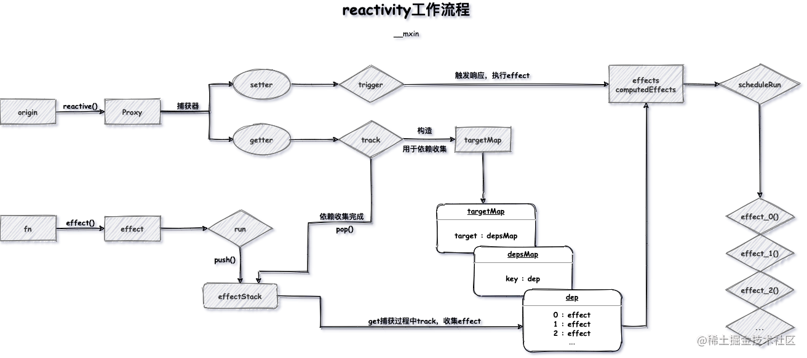

# reactivity





## JavaScript Proxy

正如 [mdn](https://developer.mozilla.org/en-US/docs/Web/JavaScript/Reference/Global_Objects/Proxy) 对 proxy 的介绍

```
The Proxy object enables you to create a proxy for another object, which can intercept and redefine fundamental operations for that object.
```
Proxy 对象用于创建一个对象的代理，从而实现基本操作的拦截和自定义（如属性查找、赋值、枚举、函数调用等）

其功能非常类似于设计模式中的代理模式

Proxy 在目标对象的外层搭建了一层拦截，外界对目标对象的某些操作，必须通过这层拦截。

使用 Proxy 的好处是对象只需关注于核心逻辑，一些非核心的逻辑（如：读取或设置对象的某些属性前记录日志；设置对象的某些属性值前，需要验证；某些属性的访问控制等）可以让 Proxy 来做。从而达到关注点分离，降低对象复杂度的目的。

Proxy 的基本语法如下：

通过构造函数来生成 Proxy 实例，构造函数接收两个参数。target 参数是要拦截的目标对象，handler 参数也是一个对象，用来定制拦截行为。

Vue 3.0 主要就采用的 Proxy 特性来实现响应式，相比以前的 Object.defineProperty 有以下优点：

- 可以劫持整个对象，并返回一个新的对象
- 有 13 种劫持操作

## reactive

创建响应式对象，在 Proxy 中定义 `get` 及 `set` 捕获器，对传入的 `源对象` 进行拦截处理

若`get` 捕获到当前对象的属性也是对象，要进行递归处理

```js
function reactive(raw) {
    return new Proxy(raw, {
        get(target, key) {
            const res = Reflect.get(target, key);
            if (isObject(res)) {
                return reactive(res)
            }
            // 依赖收集
            track(target, key)
            return res
        },
        set(target, key, value) {
            const res = Reflect.set(target, key, value);
            // 触发依赖
            trigger(target, key)
            return res;
        }
    })
}
```
## effect

副作用，创建用于管理 `effect` 的栈，将 `effect` 先入栈用于依赖收集，执行一次该 `effect` ，进入 `get` 捕获阶段。

```js
class ReactiveEffect {
    private _fn: any
    constructor(fn) {
        this._fn = fn
    }
    run() {
        activeEffect = this
        this._fn()
    }
}
let activeEffect
/**
 * 副作用函数
 * @param {*} fn
 */
export function effect(fn) {
    const _effect = new ReactiveEffect(fn)
    _effect.run()
}
```

调用`effect`要返回一个 `function` ，叫做`runner`，当`function`再次执行传给`effect` 的`fn`，并且调用`fn`的时候会把`fn`的返回值返回 

```js
// effect.ts
class ReactiveEffect {
    private _fn: any
    constructor(fn) {
        this._fn = fn
    }
    run() {
        activeEffect = this
+       return this._fn()
    }
}
export function effect(fn) {
    // fn()
    const _effect = new ReactiveEffect(fn)
    _effect.run()
+   return _effect.run.bind(_effect)
}
```

## track


- effect 执行后数据触发 get 捕获器, 在此过程中调用 track 进行依赖收集
- 定义 targetMap ，以 WeakMap 的方式收集依赖，管理目标对象 target 及其对应的 key 


```js
/**
 * 依赖收集
 * @param {*} target
 * @param {*} key
 */
function track(target, key) {
    // target->key->dep
    let depsMap = targetMap.get(target)
    if (!depsMap) {
        depsMap = new Map()
        targetMap.set(target, depsMap)
    }
    let dep = depsMap.get(key)
    if (!dep) {
        dep = new Set()
        depsMap.set(key, dep)
    }
    dep.add(activeEffect);
}
```


## trigger

修改在 effect 中指定过的内容时会触发 set 捕获器，在此过程中 trigger 负责执行当前 target 下 key 对应的 effect ，完成响应式的过程

```js
/**
 * 触发更新，执行effect
 * @param {*} target
 * @param {*} key
 */
export function trigger(target, key) {
    let depsMap = targetMap.get(target)
    let dep = depsMap.get(key)
    for (const effect of dep) {
        effect.run()
    }
}
```

## scheduler

- 通过effect第二个参数给定的 一个 `scheduler` 的`fn`
- 当`effect`第一次执行的时候还会执行`fn`
- 当响应式对象`set update`不会执行`fn`，而是执行`scheduler`
- 如果当执行`runner`的时候会再次执行`fn`

参考如下单元测试

```js
it('scheduler', () => {
    let dummy;
    let run: any;
    const scheduler = jest.fn(() => {
        run = runner
    })
    const obj = reactive({ foo: 1 })
    const runner = effect(() => {
        dummy = obj.foo
    }, { scheduler });
    expect(scheduler).not.toHaveBeenCalled()
    expect(dummy).toBe(1)
    obj.foo++
    expect(scheduler).toHaveBeenCalledTimes(1)
    expect(dummy).toBe(1)
    run()
    expect(dummy).toBe(2)
})
```

实现

```js
export function trigger(target, key) {
    let depsMap = targetMap.get(target)
    let dep = depsMap.get(key)
    for (const effect of dep) {
+       if (effect.scheduler) {
+           effect.scheduler()
        } else {
            effect.run()
        }
    }
}
let activeEffect
export function effect(fn, options: any = {}) {
+   const scheduler = options.scheduler;
+   const _effect = new ReactiveEffect(fn, scheduler)
   _effect.run()
+   return _effect.run.bind(_effect)
}
```


## stop

:::info
- stop： 阻止响应式值的更新，后面调用runner，值又可以发生更新。参数是runner
:::
------

思路：

- 如果不想通知的话，只需要把依赖里面的对应`deps`的`effect`删除即可
- 如何通过`effect`找到对应的`dep`: 需要提前记录一下

```js
// effect.ts
class ReactiveEffect {
    private _fn: any
    deps = []
    constructor(fn, public scheduler?) {
        this._fn = fn
    }
    // ...
    stop() {
        this.deps.forEach((dep: any) => {
            dep.delete(this)
        })
    }
}
export function track(target, key) {
    // target->key->dep
    if (!activeEffect) return
    // 反向收集
    dep.add(activeEffect);
    activeEffect.deps.push(dep)
}
```


> 性能优化

存在的问题：频繁调用`stop`

不需要每次都执行`stop`，只执行一次即可

```js
class ReactiveEffect {
    active = true
    stop() {
        if (this.active) {
            cleanUpEffect(this)
            this.active = false
        }
    }
}
```

## onStop


:::info
- onStop：调用stop后的回调函数，允许用户在这里做些额外的处理
:::
------


思路：只需要判断有没有`onStop`，如果有，执行就完事了

```js
class ReactiveEffect {
    onStop?: () => void
    constructor(fn, scheduler?: Function) {
        this._fn = fn
        this.scheduler = scheduler
    }
    stop() {
        if (this.active) {
            cleanupEffect(this)
+           if (this.onStop) {
+               this.onStop()
+           }
            this.active = false
        }

    }
}
export function effect(fn, options: any = {}) {
    const _effect = new ReactiveEffect(fn, options.scheduler)

    extend(_effect, options)

    _effect.run()

    const runner: any = _effect.run.bind(_effect)
    runner.effect = _effect // 挂载一下，方便stop函数里面获取effect
    return runner
}
```

## readonly

:::info
- readonly 和 reactive 唯一的区别：不能set，意味着不需要收集和触发依赖
:::
------

工程目录重构

```ts
// reactive.ts
import { mutableHandlers, readonlyHandlers } from "./baseHandlers";

export function reactive(raw) {
    return createActiveObject(raw, mutableHandlers)
}
+ export function readonly(raw) {
+    return createActiveObject(raw, readonlyHandlers)
+ }
function createActiveObject(raw: any, baseHandlers) {
    return new Proxy(raw, baseHandlers)
}
```

```ts
// baseHandlers.ts
import { track, trigger } from "./effect";
const get = createGetter()// 抽出来，让他只会在初始化的时候调用一次
const set = createSetter()
+ const readonlyGet = createGetter(true)
function createGetter(isReadOnly = false) {
    return function get(target, key) {
        const res = Reflect.get(target, key);
+       if (!isReadOnly) {
            track(target, key)
        }
        return res
    }
}
function createSetter() {
    return function set(target, key, value) {
        const res = Reflect.set(target, key, value);
        // 触发依赖
        trigger(target, key)
        return res;
    }
}

export const mutableHandlers = {
    get,
    set
}
export const readonlyHandlers = {
+   get: readonlyGet,
    set(target, key, value) {
        // warning
+       console.warn(`key:${key} set 失败 因为target是readonly`, target);
        return true
    }
}
```

## isReactive 和 isReadonly

思路：之前已经做过是不是`readOnly`，通过这个变量就能知道当前触发的`get`操作是个什么类型，所以想办法让`isReactive` 和 `isReadonly`触发get

怎么触发get：`value['xxx']`任意都可以触发`get`操作，只不过`key`不一样

```ts
// reactive
export const enum ReactiveFlags {
    IS_REACTIVE = "__v_isReactive",
    IS_READONLY = "__v_isReadonly"
}
export function isReactive(value) {
    return !!value[ReactiveFlags.IS_REACTIVE] 
    // 如果是reactive，就会调用get；如果不是，就不会调用get，
    // 也就会value[ReactiveFlags.IS_REACTIVE]==undefined，
    // !!处理一下转正boolean就可以
}
export function isReadOnly(value) {
    return !!value[ReactiveFlags.IS_READONLY]
}
```

```ts
// baseHandlers.ts
function createGetter(isReadOnly = false) {
    return function get(target, key) {
+       if (key === ReactiveFlags.IS_REACTIVE) {
+           return !isReadOnly // 只要不是readonly就是一个reactive
+       } else if (key === ReactiveFlags.IS_READONLY) {
            return isReadOnly
        }
        const res = Reflect.get(target, key);
        if (!isReadOnly) {
            track(target, key)
        }
        return res
    }
}
```

## computed

这里采用简单粗暴的方式，直接返回一个 effect 

```js
/**
 * 计算属性
 * @param {*} fn 
 */
function computed(fn) {
  return {
    get value() {
      return effect(fn)
    },
  }
}
```


## 参考链接

https://juejin.cn/post/6871164853751873550